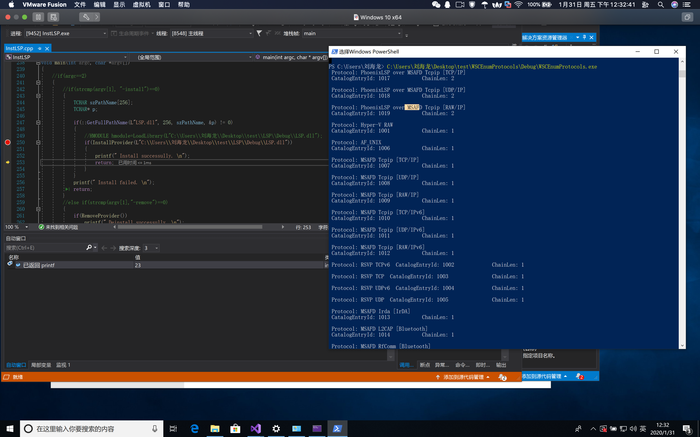
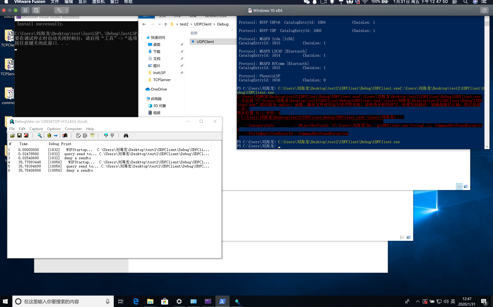

# 第二课 基于SPI层的网络过滤
* 搞定几个基本问题
1. 什么是SPI？

SPI是winsock服务提供者接口（Server Provider InterFace),他是应用程序使用的服务，而它本身不是应该程序，它的作用是向加载这个服务的应该程序导出自己，它做中间层的作用。SPI由其中的俩个部分组成——传输服务提供者（Transport Service Provider)和命名空间服务提供者（Name Space Providers),它允许用户开发这俩种类型的服务提供者,如图所示。


2. 什么是传输服务提供者（Transport Service Provider)？

传输服务提供者是提供建立连接、传输数据、行使流控制、出错控制的服务。它有俩种类型：分层的（Layered）和基础的（Base）。基础服务提供者可以理解为提供的最小的、最基本的基础函数，分层服务提供者是基于基础服务提供者的上层服务提供者。因此一般添加修改服务提供者都是分层服务提供者，也可以是基础协议。

3. 什么是命名空间服务提供者（Name Space Providers)？

命名空间服务提供者与传输服务提供者相似，所不同的是它截获名称解析Winsock API调用，如gethostbyname 和 WSALookupServiceBegin。命名空间提供者在命名空间目录安装自己，当应用程序执行名字解析时将会被调用。

4. 什么是Winsock 协议目录？

Winsock 服务提供者API包含在WS2SPI.H文件中。共有4种类型的SPI函数，如下图所示。


这里我们以LSP（从分层传输服务提供者）的SPI函数为例，因为基础传输提供者和命名空间提供者通常仅对操作系统开发商和传输堆栈商有效，LSP是系统组件，SPI提供3种协议：分层协议，基础协议和协议链。分层协议基于基础协议，协议链是将一系列的分层协议与基础协议按特定的顺序连接在一起的链状结构。

系统上可用的不同协议包含在Winsock目录中，每一个协议都有一个目录入口，Winsock用WSAPROTOCOL_INFO结构描述特定协议的完整信息，遍历所有SPI协议就是遍历所有的WSAPROTOCOL_INFO结构，一个[WSAPROTOCOL_INFO](https://docs.microsoft.com/en-us/previous-versions/aa916786(v=msdn.10))结构称为一个Winsock目录入口。也就目录包含所有的WSAPROTOCOL_INFO结构（目录入口/协议入口)。
```
typedef struct _WSAPROTOCOL_INFO {
  DWORD dwServiceFlags1;
  DWORD dwServiceFlags2;
  DWORD dwServiceFlags3;
  DWORD dwServiceFlags4;
  DWORD dwProviderFlags;
  GUID ProviderId;
  DWORD dwCatalogEntryId;
  WSAPROTOCOLCHAIN ProtocolChain;
  int iVersion;
  int iAddressFamily;
  int iMaxSockAddr;
  int iMinSockAddr;
  int iSocketType;
  int iProtocol;
  int iProtocolMaxOffset;
  int iNetworkByteOrder;
  int iSecurityScheme;
  DWORD dwMessageSize;
  DWORD dwProviderReserved;
  TCHAR szProtocol[WSAPROTOCOL_LEN+1];
} WSAPROTOCOL_INFO, *LPWSAPROTOCOL_INFO;
```

总结一句就是微软在3环也有很多层每层都取了个名字。

* 基于SPI的数据过滤器

* 
* 


* https://github.com/haidragon/lsp
* https://github.com/jpalanco/LSP
* https://github.com/haidragon/WinLSP
* https://github.com/shavenG/LSP-Firewall
* https://github.com/xianyue390348/LSPLearn-Demo


